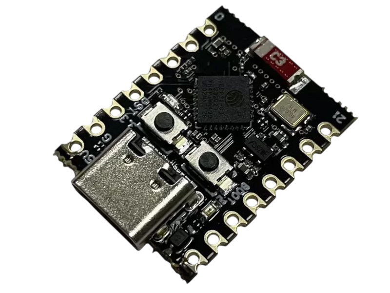
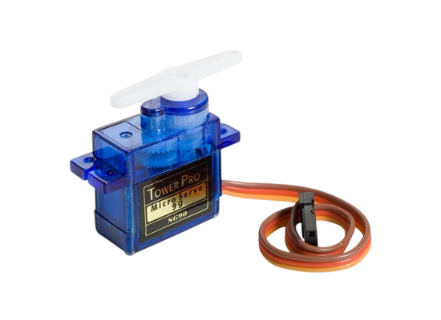
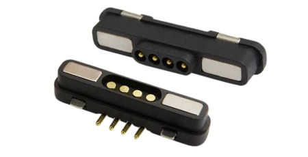
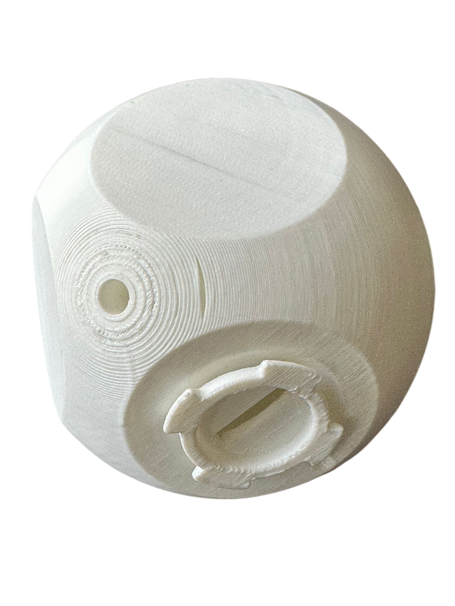
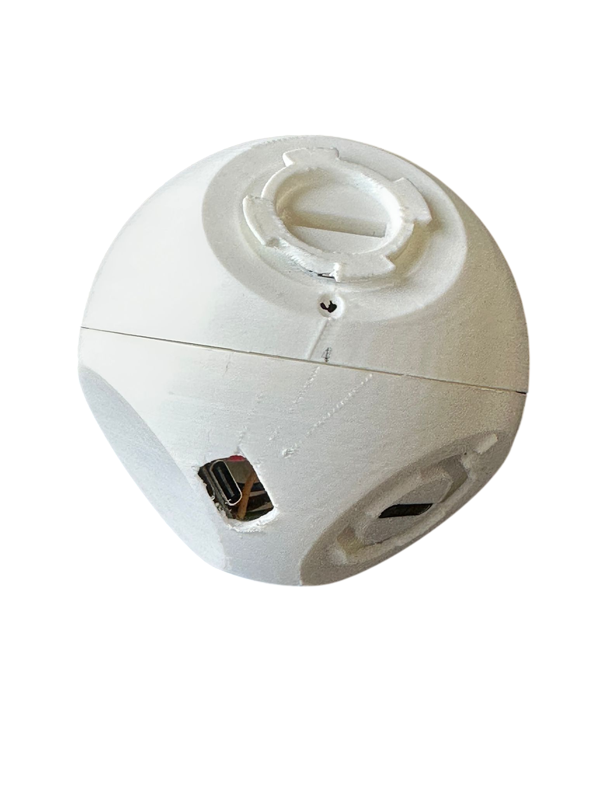

# Molecubes - Modular Robotic Arm

//TODO layout pins 

<div align="center">

</div>

---

<div align="center">

              

</div>

---

<div align="justify">

<details>
<summary><h2>Table of Contents 📖</h2></summary>

- [Molecubes - Modular Robotic Arm](#molecubes---modular-robotic-arm)
  - [Table of Contents](table-of-contents)
  - [Idea of the project 💡](#idea-of-the-project-)
  - [Requirements 📋](#requirements-)
    - [Hardware Requirements 🔧](#hardware-requirements-)
    - [Software Requirements 💻](#software-requirements-)
  - [Getting Started 🚀](#getting-started-)
    - [Setting up the Base Module 🏗️](#setting-up-the-base-module-)
    - [Setting up the Cube Modules 🧱](#setting-up-the-cube-modules-)
    - [Setting up Wiring 🔌](#setting-up-wiring-)
    - [Setting up ESP32 Software 🔨](#setting-up-esp32-software-)
    - [Setting up Python Communication 🖥️](#setting-up-python-communication-)
  - [Project Layout 📂](#project-layout-)
  - [How It Works ⚡](#how-it-works-)
  - [Usage 🎮](#usage-)
  - [User guide 📑](#user-guide-)
  - [License](#license-)

</details>

<!--=========================================================================-->

## Idea of the project 

---
<!--=========================================================================-->

The main idea of the Molecubes project is to build a modular robotic arm that utilizes a unique approach to movement through motor twisting. This design provides significantly more freedom of movement, allowing the arm to achieve various positions with different twists. The arm consists of interconnected cubes, each containing a servomotor, connected via magnetic connectors for easy assembly and reconfiguration.

The system is controlled by an ESP32-S3 microcontroller in the base module, with communication handled through Python scripts for user interaction and control.

## Requirements 

---
<!--=========================================================================-->

### Hardware Requirements 

- <u>**ESP32-C3**</u> microcontroller for the base module
- 3D printed housing for the base module
- Full set of cables (male-to-male, male-to-female)
- For each cube module:
  - 1x <u>**3D printed housing**</u>
  - 1x <u>**Servomotor**</u>
  - <u>**Set of cables**</u>
  - 2x <u>**Headed pin magnetic connectors**</u>

- 1x <u>**Breadboard**</u> (optional for prototyping)

<div style="display: flex; justify-content: space-between; align-items: center;">
    
    
    
    
    
</div>

### Software Requirements 

- [PlatformIO IDE](https://platformio.org/)
- Python IDE (e.g. [PyCharm](https://www.jetbrains.com/pycharm/), [VS Code](https://code.visualstudio.com/))

#### Setting Up Python 

To run this project, you need to have PlatformIO IDE and Python installed along with the required dependencies.

## Getting Started 

---

<!--=========================================================================-->

### Setting up the Base Module 

The project begins with the assembly of the base module:

1. **3D Print the Base Housing**: Print the base housing using PLA material.
2. **Install ESP32-C3 and servo motor**: Mount the ESP32-C3 microcontroller, servomotor and connectors inside the housing.
3. **Flash the base esp32 with the root code**: Run PlatformIO esp32-c3-root task to upload the firmware.
3. **Connect Power and Interfaces**: Ensure proper connections for power supply, do not power more than a cube with usb.

### Setting up the Cube Modules 

Each cube module requires the following assembly:

1. **3D Print the Cube Housing**: Print the cube housing using PLA material.
2. **Install Servomotor and ESP32-C3**: Mount the servomotor,ESP32-C3 and connectors inside the housing, ensuring proper alignment for twisting motion.
3. **Attach Magnetic Connectors**: Install the 2 headed pin magnetic connectors on opposite faces of the cube for modular connection.
4. **Wire the Components**: Connect the servomotor to the appropriate cables for power and signal transmission.

### Setting up Wiring


---

The wiring process connects the ESP32-S3 base to the cube modules:

1. **Power Supply**: Connect the ESP32-S3 to a stable power source (typically 5V).
2. **Module Connections**: Use the magnetic connectors to link cube modules together and to the base.
3. **Signal Cables**: Route signal cables from each servomotor to the ESP32-S3 GPIO pins.
4. **Communication Setup**: Ensure serial communication lines are properly connected between modules if needed.

### Setting up ESP32 Software 🔨

---

To program the ESP32-S3, follow these steps:

1. **Install PlatformIO IDE**
   - Download and install PlatformIO IDE from the official website: [PlatformIO Download](https://platformio.org/platformio-ide).
   - Open the project in PlatformIO.

2. **Configure the Project**
   - Ensure the `platformio.ini` file is properly configured for ESP32-S3.
   - Install necessary libraries (e.g., servo control libraries).

3. **Build and Upload**
   - Build the project using PlatformIO.
   - Upload the firmware to the ESP32-S3 board.

#### Project Layout 📂

```
molecubes/
├── platformio.ini                    # PlatformIO configuration
├── src/
│   ├── main.cpp                      # Main ESP32 firmware
│   └── ...
├── lib/
│   └── ...                           # Additional libraries
├── include/
│   └── ...                           # Header files
├── python_client/
│   ├── esp32_client.py               # Python communication script
│   └── requirements.txt              # Python dependencies
└── README.md                         # This file
```

* **`platformio.ini`**: Configuration file for PlatformIO build system.
* **`src/main.cpp`**: Main firmware for ESP32-S3 controlling the modular arm.
* **`python_client/`**: Contains Python scripts for communication with the ESP32.

#### How It Works ⚡

1. **Initialization**: The ESP32-S3 initializes the system and sets up communication interfaces.
2. **Motor Control**: Each cube module's servomotor receives commands to achieve specific twisting motions.
3. **Modular Movement**: The unique twisting approach allows for complex arm configurations and positions.
4. **Python Communication**: External Python scripts send commands to the ESP32 for arm control and monitoring.

#### Usage 🎮

1. **Hardware Assembly**: Assemble the base and cube modules as described.
2. **Firmware Upload**: Upload the ESP32 firmware using PlatformIO.
3. **Python Control**: Run the Python client script to communicate with and control the robotic arm.
4. **Testing Movement**: Send commands to test the modular arm's twisting capabilities and freedom of movement.

## User guide 📑

---

<!--=========================================================================-->

### Basic Operation

1. **Power On**: Ensure all modules are powered and connected.
2. **Run Python Client**: Execute the Python script to establish communication.
3. **Send Commands**: Use the Python interface to send movement commands to the arm.
4. **Monitor Response**: Observe the arm's twisting motions and position changes.

### Advanced Features

- **Modular Reconfiguration**: Disconnect and reconnect cubes using magnetic connectors for different arm configurations.
- **Custom Movements**: Program specific twisting sequences for complex tasks.

### Troubleshooting

- Check cable connections if modules don't respond.
- Verify power supply stability.
- Ensure proper magnetic connector alignment for reliable connections.

## License

This project is licensed under the MIT License - see the [LICENSE](LICENSE) file for details.

---

*For more information, please refer to the project documentation or contact the development team.*